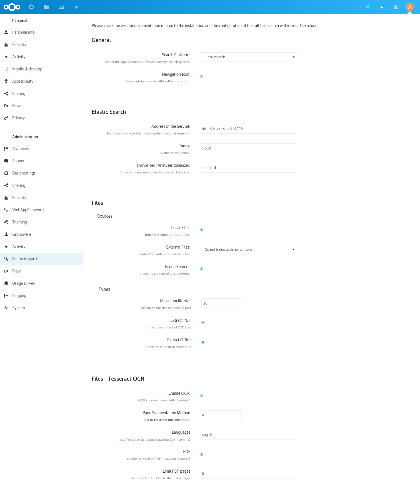

# Nextcloud Development Environment

## Installation / Running

```bash
docker-compose up
```

Afterwards you should be able to open <http://localhost:8081> (admin/admin) to
login to your Nextcloud instance.

## Full text search config

Head over to <http://localhost:8081/index.php/settings/admin/fulltextsearch> and setup the service like shown in the screenshot.



To start the indexer run:

```bash
make fulltextsearch-index
```

To constantly index new files in the foreground run:

```bash
make fulltextsearch-live
```

To stop the indexer (e.g. in case of an exception) run:

```bash
make fulltextsearch-stop
```

### Note

Turn off OCR: I currently get an exception
`Error: Call to a member function getContent() on string in /var/www/html/apps/files_fulltextsearch/lib/Service/FilesService.php:719`
when I have OCR turned on, best to turn it off at the moment (see [#100](https://github.com/nextcloud/files_fulltextsearch/issues/100)).

## Check nextcloud.log

For debugging you can show the `nextcloud.log`:

```bash
make show-log
```

There also is a [loggin web interface](http://localhost:8081/index.php/settings/admin/logging).

## Tip

In case something is broken try to reset the container:

```bash
docker-compose build; docker-compose down; docker volume prune -f
```